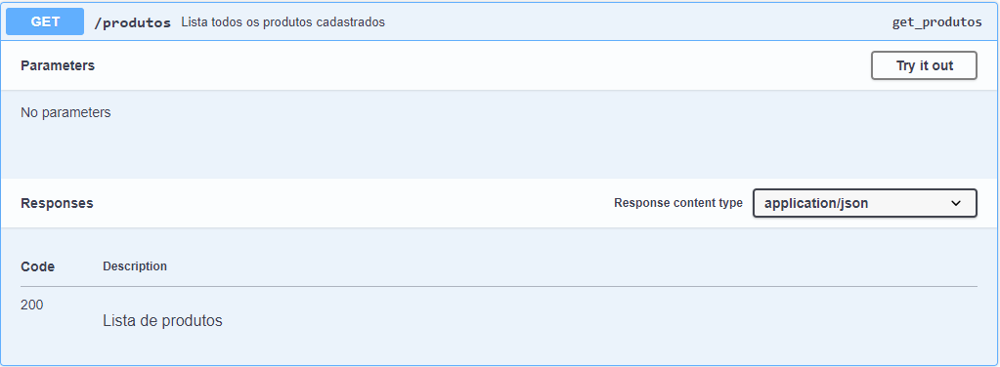
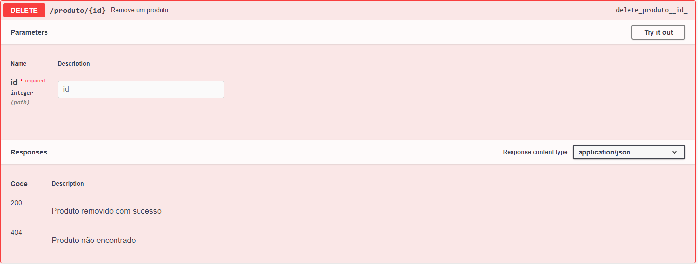

# Gerenciador de Produtos - API Flask

Esta é uma API desenvolvida em Flask para gerenciamento de produtos. Ela permite cadastrar, listar, atualizar e remover produtos utilizando um banco de dados SQLite.

## Tecnologias Utilizadas

* Python 3

* Flask

* Flask-SQLAlchemy

* Flasgger (para documentação Swagger UI)

* SQLite (banco de dados)

## Instalação e Configuração

Siga as etapas abaixo para configurar e executar o projeto em seu ambiente local:

### 1. Clone o repositório
```
git clone https://github.com/keelcoutinho/gerenciador-produtos-flask.git
cd gerenciador-produtos-flask
```
### 2. Instale as dependências
```
pip install -r requirements.txt
```
### 4. Execute a aplicação
```
python app.py
```
A API estará disponível em ``` http://127.0.0.1:5000/ ```

## Documentação da API

A documentação da API pode ser acessada através do Swagger UI em:
```
http://127.0.0.1:5000/apidocs/
```
## Endpoints Disponíveis

### Cadastrar um novo produto

**Rota**: ```POST /produto```

**Descrição**: Cadastra um novo produto

**Parâmetros**: ```imagem```, ```nome```,```valor```, ```descricao```

**Resposta de sucesso**: 201 Produto cadastrado com sucesso

Abaixo está um print da requisição ```POST``` no Swagger:


### Listar todos os produtos

**Rota**: ```GET /produtos```

**Descrição**: Retorna a lista de produtos cadastrados

**Resposta de sucesso**: 200 com lista de produtos

Abaixo está um print da requisição ```GET``` no Swagger:



### Atualizar um produto

**Rota**: ```PUT /produto/<id>```

**Descrição**: Atualiza um produto existente

**Parâmetros**: Qualquer campo pode ser atualizado (```imagem```, ```nome```,```valor```, ```descricao```)

**Resposta de sucesso**: 200 Produto atualizado com sucesso

Abaixo está um print da requisição ```PUT``` no Swagger:


### Deletar um produto

**Rota**: ```DELETE /produto/<id>```

**Descrição**: Remove um produto pelo ID

**Resposta de sucesso**: 200 Produto removido com sucesso

Abaixo está um print da requisição ```DELETE``` no Swagger:



## Considerações finais

Este projeto é uma API simples para gerenciamento de produtos e pode ser expandido conforme necessário. Contribuições são bem-vindas!

